# TRRS Cable Build Guide

* Please read through the overall process a few times before attempting.
* The parts are all cut relatively long; please adjust their lengths to your preferences.

[Instructions for straight plug with sleeving](#Instructions for straight plug with sleeving)

## Instructions for right-angle plug

### Sleeving the cable

1. Pass the paracord over the cable.
  
    * At this stage, make sure the paracord is stretched out completely (Excess bunching can make heatshrink tube insertion impossible later on)
    
    * After stretching the paracord thinly over the wire
    
2. Wrap the ends of the paracord with tape or similar
  
3. Insert the external sleeve over the paracord, pushing/bunching the sleeve together to increase diameter (Be careful, for the sleeve can fray very easily)
  

    * Similarly to the paracord, remove excess bunching by stretching the sleeve over the wire
    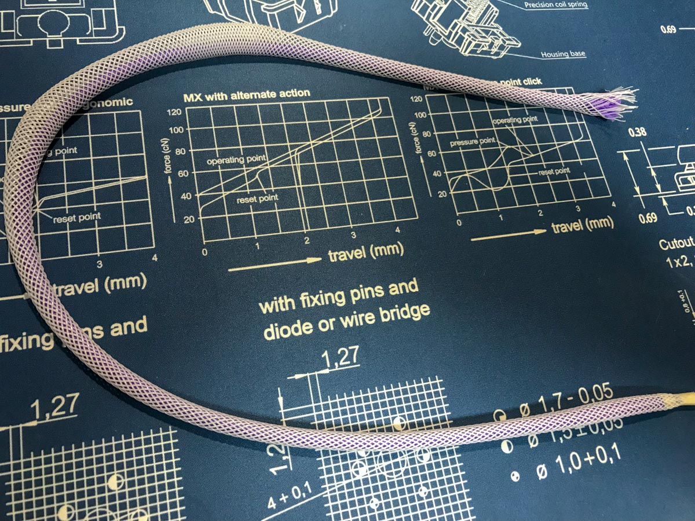
    

--------

### Removing the insulation

1. Wrap tape around the wire, giving enough working length (To prevent paracord/external sleeve from fraying)
    * Compare against a TRRS connector to check the length needed
    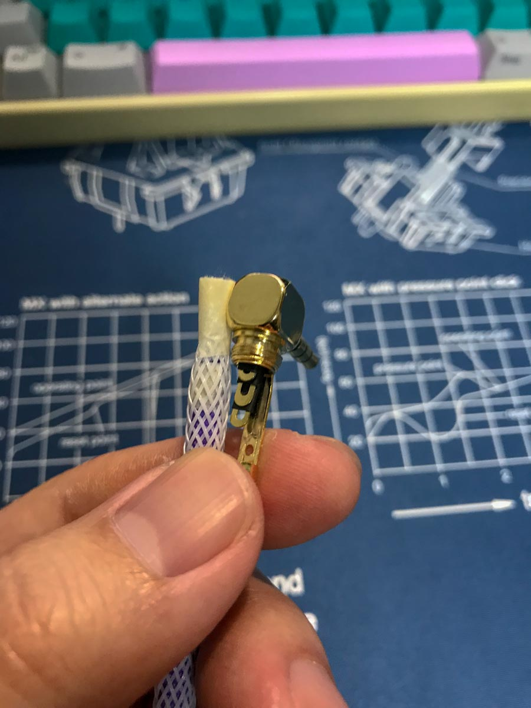
    * Wrap tape around the wire at the right position
    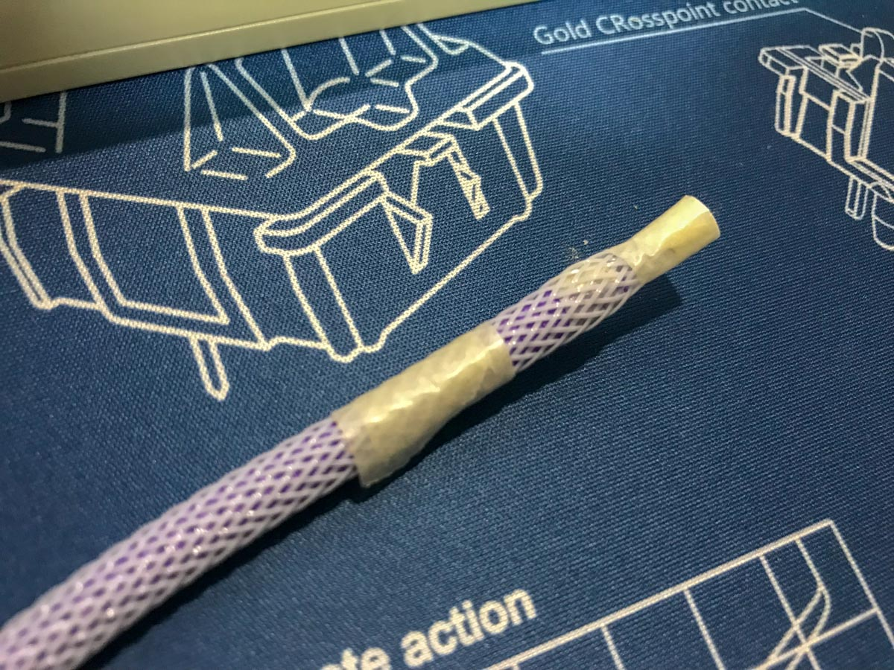
2. Cut the paracord and sleeving
    
3. Once the insulator is visible, remove just the amount necessary to solder the TRRS cable
    
    Clip any non-wire strands within the cable, for they aren't necessary here
    

--------

### Soldering the first end

1. Solder the wires to the TRRS connector
    
2. Make sure nothing is shorting against each other after soldering

--------

### Inserting the heatshrink tube and connector barrel covers

1. Cut the heatshrink tube to a nice length
    * Align it to the connector barrel, and cut it to a length so the tube extends slightly further
    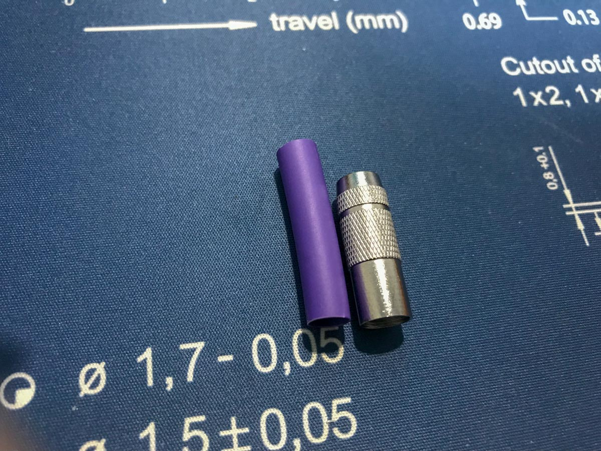
2. Insert over the cable in the order of heatshrink tube, connector barrel, connector barrel for the unsoldered end, and heatshrink tube

    **Make sure to insert both ends' worth of heatshrink tube and connector barrel covers (It is impossible to insert them once the other end is soldered)**
    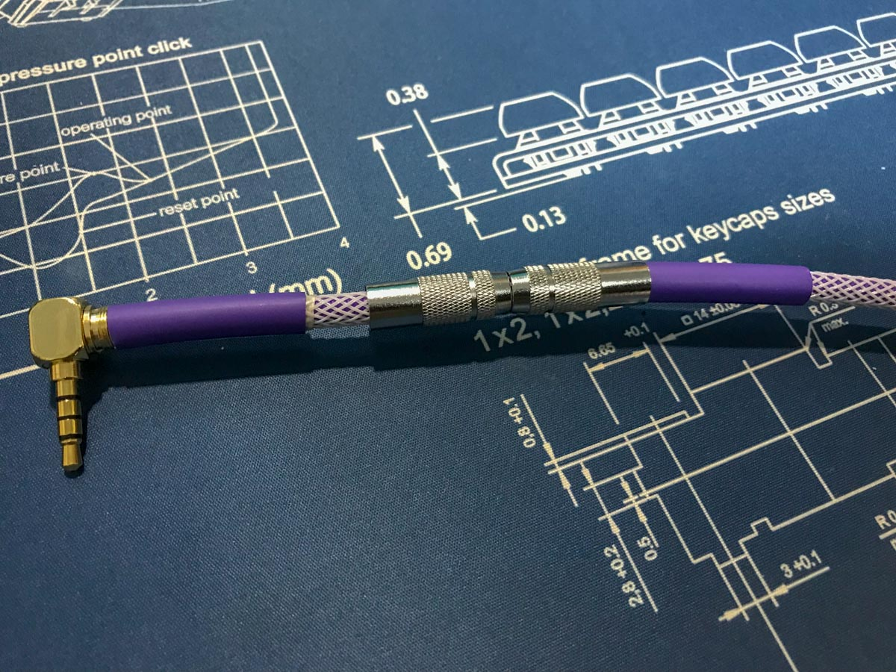

--------

## Soldering the other end

Repeat the instructions for soldering the first end

--------

## Testing continuity

Tap a multimeter against the TRRS connector parts separated by the plastic insulators, and check that everything is fine.

[Video of the process](https://twitter.com/nillpo/status/1056187819859701760)

**Since the solder joints can move and short against each other when installing the connector barrels and heatshrink tubing, it is recommended to lock the solder joints into place with epoxy.**

--------

### Install the heatshrink tubes

1. Carefully remove the tape so that the paracord and sleeving do not fray. Verify that there is no slack in the paracord or external sleeving, then heat the heatshrink tube to lock the sleeving into place.
    * Remove this tape
    
    * Bring the heatshrink tube up against the screw ridges on the connector
    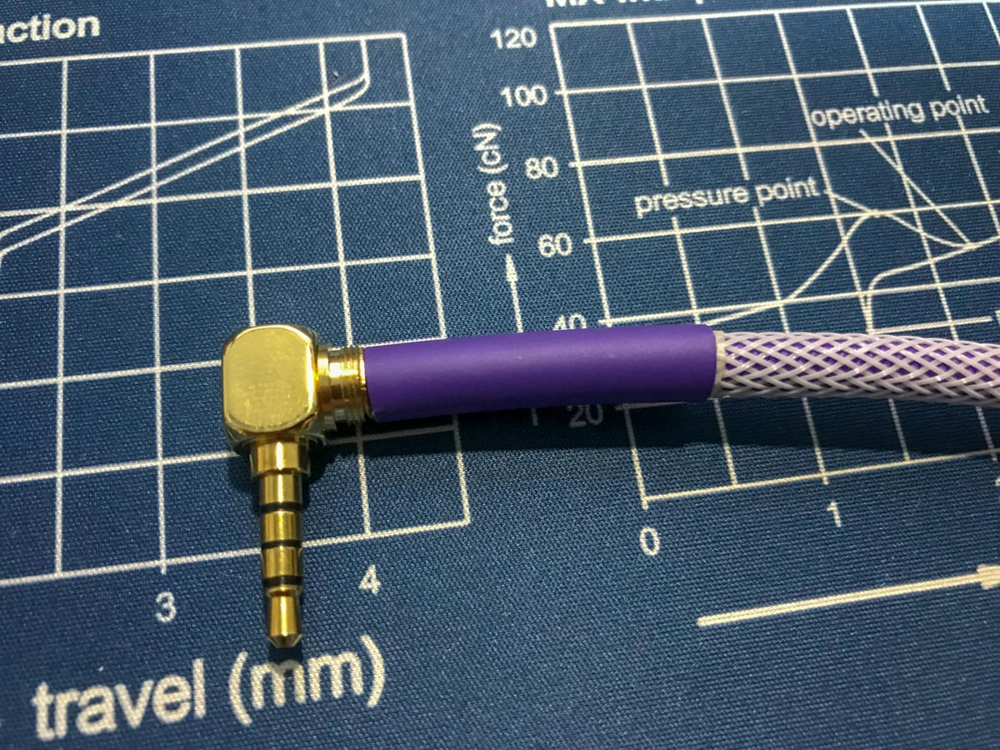
    * Heat the heatshrink tube to secure into place
    

2. Once it is completely cooled, screw the connector barrel on

--------

If it passes a multimeter test, then works fine on a keyboard, the cable is complete.
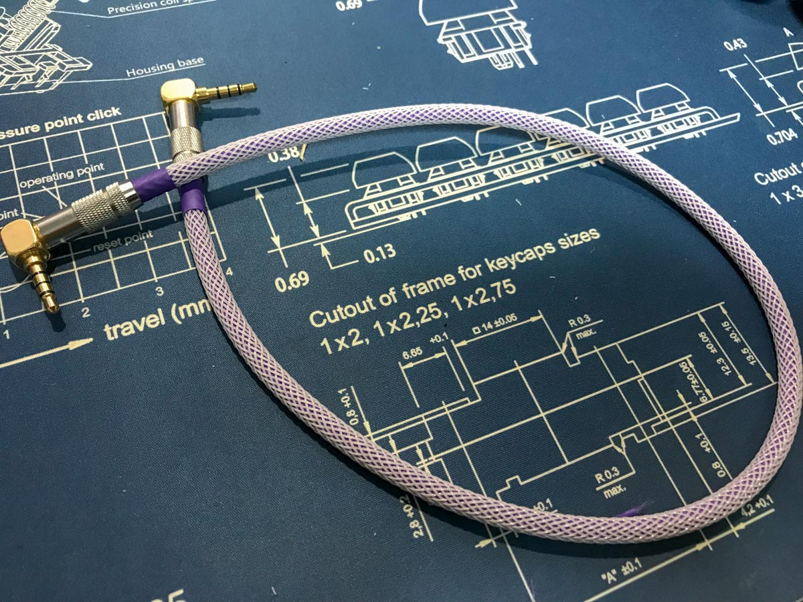

---------------

## Instructions for straight plug with sleeving

The instructions are roughly the same, but some of the steps are different.

Since the connector barrel on the straight plug has a smaller opening than that of the L-shaped plug, inserting the heat shrink tube below the barrel is impossible.

Instead, a larger diameter shrink tube is installed over the entire connector.

## Instructions

Kit contents

* Connectors
* Two sets of two shrink tubes
* Sleeving
* Paracord
* Wire

### Removing the unnecessary parts of the connectors

The parts in the red box are not used, so remove them before assembly.
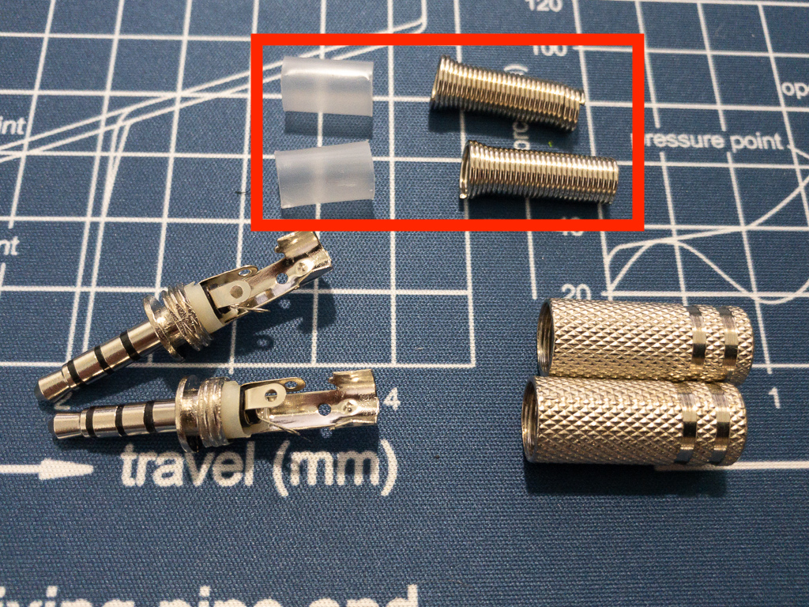

### Cut the thinner heatshrink tubes

Roughly this length.  
If they are too long, the connector barrel will not fit over them.

### Soldering the connectors

Push the connectors' solder joints outwards, and pass the wires through the holes from the inner side for easy soldering.
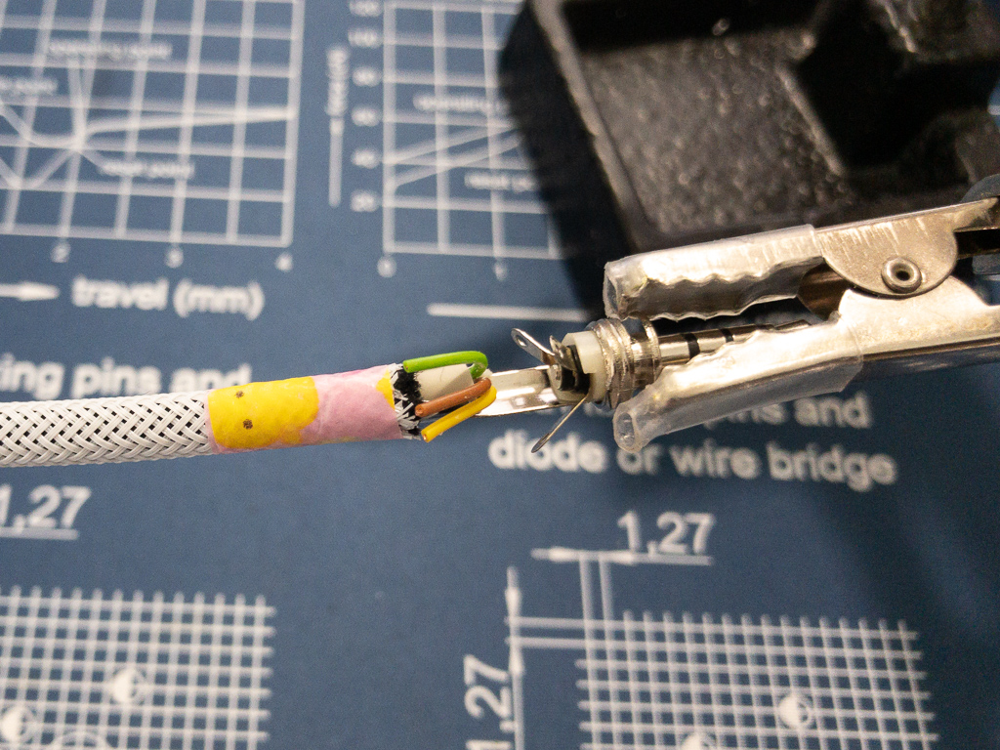

Don't forget to insert the thinner heatshrink tube and connector barrels **for both ends** once one end is soldered.

### Testing continuity

Once the connectors are soldered, check that nothing is shorting using a multimeter.

### Epoxying the solder joints

Since the straight connector has solder tabs which may move and short during use, lock them into place with epoxy or similar.
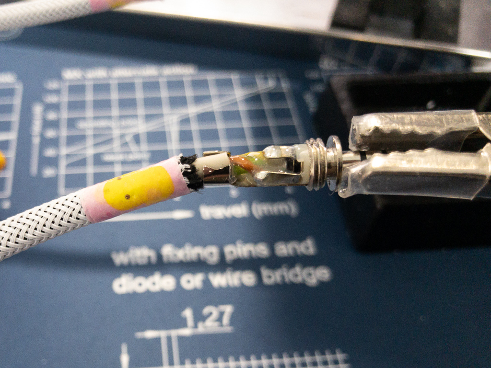

### Shrink the heatshrink tube

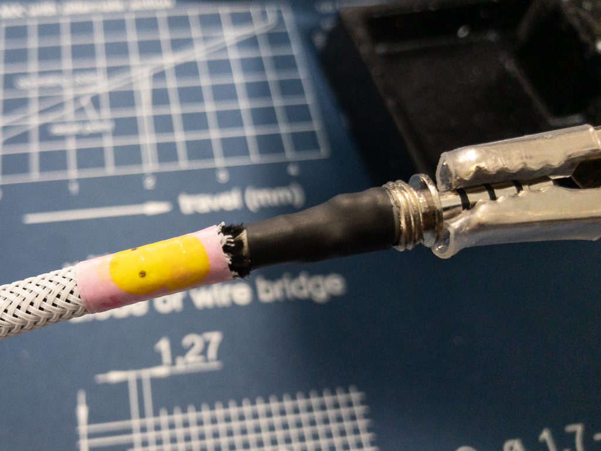
Once the thinner tubes are installed, screw on the connector barrels, then install the thicker shrink tube over the barrels.

### Complete

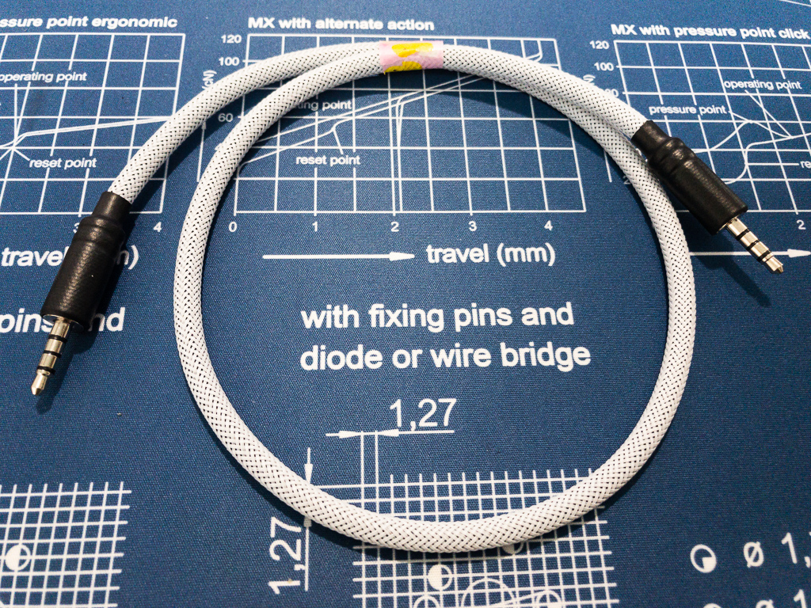
